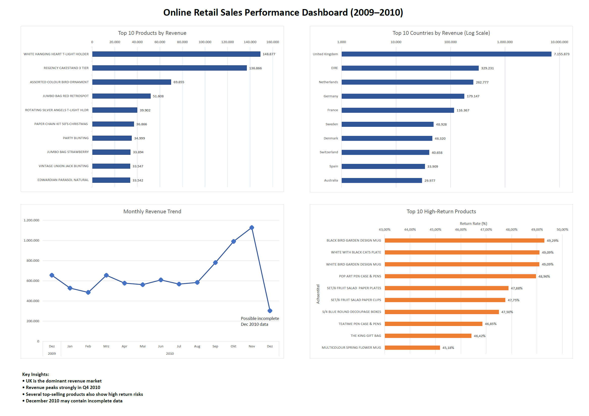

# Excel Retail Sales Analysis

**Skills:** Excel | PivotTables | Power Pivot | DAX | Dashboard Design | Business Analysis

## Project Overview
This project analyzes online retail sales data (2009–2010) using Microsoft Excel, PivotTables, Power Pivot, and dashboard visualization techniques.

The objective was to uncover key business insights related to:
- Top-performing products by revenue
- Revenue contribution by country
- Monthly sales performance trends
- High-return products and operational risks

---

## Tools & Skills Used
- Microsoft Excel
- PivotTables
- Power Pivot
- DAX Measures
- Dashboard Design
- Business Analysis
- KPI Development

---

## Key Business Questions
1. Which products generate the highest revenue?
2. Which countries contribute most to total revenue?
3. How does revenue evolve over time?
4. Which products show concerning return rates?

---

## Key Insights
- The United Kingdom dominates total revenue generation
- Revenue peaks significantly in Q4 2010, suggesting strong seasonal demand
- Several top-selling products also have high return rates
- December 2010 data may be incomplete and should be interpreted cautiously

---

## Business Recommendations
- Investigate high-return products for quality or customer expectation issues
- Strengthen Q4 inventory and sales planning
- Diversify revenue streams beyond UK market concentration
- Implement return-risk monitoring for high-volume products

---

## Dashboard Preview

---

## Included Files
- Excel workbook with full analysis
- Dashboard PDF report
- Dashboard screenshot

---

## Project Outcome
This project demonstrates practical Excel-based data analytics capabilities, including:
- Data exploration
- Revenue analysis
- Geographic market analysis
- Return-risk evaluation
- Executive dashboard creation